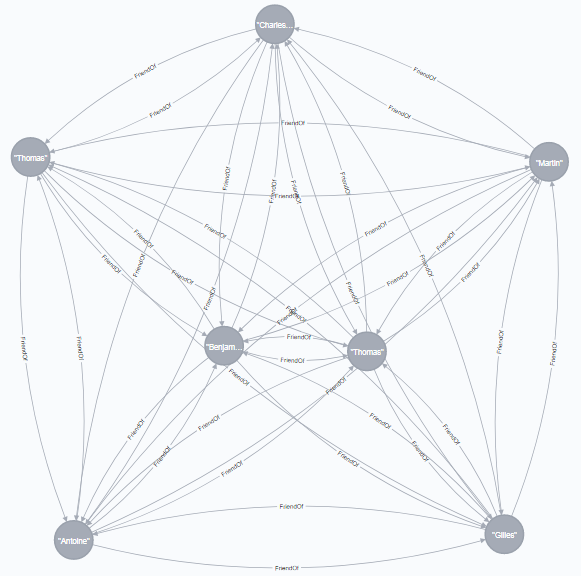

# Archipelago

De nos jours, les unités de stockages sont de plus en plus accessible au grand public, les différentes entreprises impliquées dans le développement des systèmes de gestion de base de données l'ont bien compris. Depuis plusieurs années, L'hégémonie des bases de données relationnelles se fait de moins en moins écrasante, le solutions alternatives du NoSql séduisent jours après jours de grandes entreprises. 

La grande force des SGBDR provient des fondement théorique mis en place en 1970 par Edgar Frank Codd, IBM défini le langage "Structured Query Language" (SQL) pour utiliser ce système. Cette normalisation de la représentation de l'information génère un sentiment de sûreté pour les architectes de logiciels.

A contrario, le mouvement NoSql pour "Not Only SQL" ne se base pas sur un fondement théorique commun. Que ce soit la théorie des graphs, les systèmes de hash key/value avec partitions, ... chaque système choisit ce sur quoi il va se baser. Mais si il existait une sorte de contrat liant les SGBD NoSql entre eux afin d'assurer une cohérence d'utilisation, ce mémoire va se concentrer sur les implémentations de la théorie des graph, en essayant de mettre en place un système de comparaison, nous allons tenter de spécifier certains objectifs commun et développer un framework Java permettant d'utiliser de manière agnostique l'une ou l'autre base de donnée.

Archipelago est un framework java qui permet à l'utilisateur de manipuler de manière simple et efficace des Bases de données orientées graphes.
Il est le sujet d'un mémoire de L'université de Namur dans le cadre d'un Master en Informatique.

```java
public class MainTest {

    public static void main(String[] args) throws Exception {
        Archipelago a = Archipelago.getInstance();
        List<Object> students = Lists.newArrayList();
        Student gilles = new Student("Gilles", "Bodart", LocalDate.of(1992, 4, 14), "M", Lists.newArrayList(), null, null, null);
        Student thomasB = new Student("Thomas", "Blondiau", LocalDate.of(1992, 1, 5), "M", Lists.newArrayList(), null, null, null);
        Student thomasR = new Student("Thomas", "Reynders", LocalDate.of(1992, 1, 22), "M", Lists.newArrayList(), null, null, null);
        Student charly = new Student("Charles-Antoine", "Van Beers", LocalDate.of(1992, 4, 28), "M", Lists.newArrayList(), null, null, null);
        Student antoine = new Student("Antoine", "Dumont", LocalDate.of(1992, 12, 28), "M", Lists.newArrayList(), null, null, null);
        Student martin = new Student("Martin", "Périlleux", LocalDate.of(1992, 2, 28), "M", Lists.newArrayList(), null, null, null);
        Student benjamin = new Student("Benjamin", "Leroy", LocalDate.of(1992, 10, 31), "M", Lists.newArrayList(), null, null, null);
        thomasB.setFriends(Lists.newArrayList(gilles, thomasR, charly, antoine, martin, benjamin));
        thomasR.setFriends(Lists.newArrayList(thomasB, gilles, charly, antoine, martin, benjamin));
        charly.setFriends(Lists.newArrayList(thomasB, thomasR, gilles, antoine, martin, benjamin));
        antoine.setFriends(Lists.newArrayList(thomasB, thomasR, charly, gilles, martin, benjamin));
        martin.setFriends(Lists.newArrayList(thomasB, thomasR, charly, antoine, gilles, benjamin));
        benjamin.setFriends(Lists.newArrayList(thomasB, thomasR, charly, antoine, martin, gilles));
        students.add(gilles);
        students.add(thomasB);
        students.add(thomasR);
        students.add(charly);
        students.add(antoine);
        students.add(martin);
        students.add(benjamin);
        a.persist(students);
        ArchipelagoQuery aq = a.getQueryBuilder()
                .getObject()
                .of(Student.class)
                .where(of("firstName", "Thomas"), ConditionQualifier.EQUAL)
                .build();
        List<Object> nodes = a.execute(aq);
        nodes.stream().forEach(System.out::println);
    }
}
```
## Configuration

Archipelago est une couche abstraite au dessus de la couche de persistence.

Pour configurer le framework, il suffit de mettre un fichier nommé `config.archipelago.json` dans les ressources.

### Neo4J configuration

```json
{
  "database": {
    "type": "NEO4J",
    "username": "neo4j",
    "password": "********",
    "url": "*********",
    "name": "memory",
    "embedded": false,
    "port": 4567
  },
  "deepness": 3,
  "domainRootPackage": "org.archipelago.test.domain.school"
}
```


### OrientDB configuration
```json
{
  "database": {
    "type": "ORIENT_DB",
    "username": "gilles",
    "password": "*******",
    "url": "********",
    "name": "memoire",
    "port": 1234
  },
  "deepness":3,
  "domainRootPackage":"org.archipelago.test.domain.school"
}
```


> If friendship is a graph Archipelago will persist it
